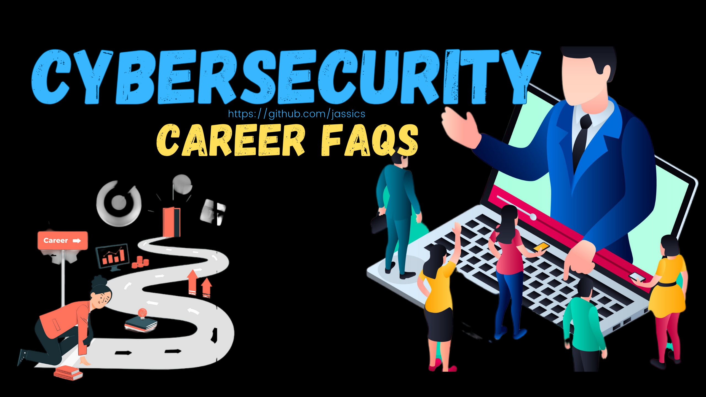

# Cybersecurity Career Advice FAQs
**FAQs for cybersecurity career advice from security experts.**

These FAQs should provide a comprehensive overview for those considering a cybersecurity career, addressing entry-level concerns and long-term career development.
We would also cover FAQs for security professionals seeking advice on job switches, upskilling, domain switches, etc.

## FAQs for Aspiring Cybersecurity Professionals
### What educational background is needed for a career in cybersecurity?

Answer: While a degree in computer science, information technology, or a related field is beneficial, it is optional. Many successful cybersecurity professionals come from diverse educational backgrounds. Certifications like CompTIA Security+, CISSP, CEH, and others are highly valued and can sometimes substitute for a formal degree.

### Which certifications are most valuable in the cybersecurity field?
Answer: Some of the most recognized and valuable certifications include:
1. Entry-level: CompTIA Security+, Cisco's CCNA Security, Certified Ethical Hacker (CEH)
2. Intermediate: GPEN, GIAC Security Essentials (GSEC), GWEB, OSCP, eJPT
3. Advanced: Certified Information Systems Security Professional (CISSP), CSSLP, Certified Information Security Manager (CISM), Certified Information Systems Auditor (CISA)

### What skills are crucial for a successful career in cybersecurity?
Answer: Key skills include:
1. Technical skills: Understanding networks, operating systems, and programming languages (e.g., Python, Java).
2. Analytical skills: Ability to analyze complex systems and identify potential vulnerabilities.
3. Problem-solving skills: Creativity in developing solutions to security challenges.
4. Communication skills: Ability to explain technical issues to non-technical stakeholders.

### What entry-level positions are available in cybersecurity?
Answer: Common entry-level positions include:
1. Security Analyst
2. Security Operations Center (SOC) Analyst
3. IT Auditor
4. Junior Penetration Tester
5. Incident Responder

### How important is practical experience, and how can I gain it?
Answer: Practical experience is crucial in cybersecurity. You can gain experience through:
1. Internships 
2. Volunteering for non-profits or small businesses
3. Participating in capture-the-flag (CTF) competitions
4. Setting up your lab environment at home to practice

### What are the current trends and emerging areas in cybersecurity?
Answer: Some current trends include:
1. Cloud Security
2. Artificial Intelligence and Machine Learning in Security
3. Internet of Things (IoT) Security
4. Zero Trust Architecture
5. Threat Intelligence and Analytics

### How can I stay updated with the latest cybersecurity developments?
Answer: Staying updated in this domain is essential. You can:
1. Subscribe to cybersecurity blogs and podcasts (e.g., Krebs on Security, Darknet Diaries)
2. Follow industry leaders on social media
3. Attend conferences and webinars (e.g., DEF CON, Black Hat)
4. Participate in online forums and communities (e.g., Reddit, Stack Exchange)

### What is the job outlook for cybersecurity professionals?
Answer: The job outlook for cybersecurity professionals is very positive. As cyber threats become more sophisticated, the demand for skilled cybersecurity experts continues to grow. The Bureau of Labor Statistics projects a much faster-than-average growth rate for information security analysts.

### What do cybersecurity professionals face some common challenges?
Answer: Some common challenges include:
1. Keeping up with the rapidly evolving threat landscape
2. Managing stress and burnout due to high-pressure environments
3. Balancing security measures with user convenience
4. Continuous learning and upskilling to stay relevant

### Can I move into cybersecurity from another IT role?
Answer: Yes, many professionals transition into cybersecurity from other IT roles. Skills and experience in network administration, software development, or systems engineering are highly transferable to cybersecurity roles.

### Is programming knowledge necessary for success in the cybersecurity domain?
Well, it depends! 
Programming knowledge is essential in cybersecurity. It helps understand how software works, identify vulnerabilities, write automation scripts, conduct code reviews, and analyse malware. 

While not mandatory for every role, it's crucial for advanced areas like application security, reverse engineering, and secure software development. I'm also partially into the pentest job.

My suggestion is to learn the very basics of programming, like Python, and understand how to read and execute code.

### It is necessary to be good at communication and soft skills; if so, why?
Aboslutely yes. Communication and soft skills are essential in cybersecurity. 
Security professionals must explain technical risks to non-technical stakeholders, collaborate with teams, and influence decision-making. 
Soft skills also help effectively manage security policies, incident response, and training.

> [!TIP]
> Moreover, when you grow up the ladder, you will see why people with good soft skills and writing skills are preferred in senior roles. That means you should be very good at your core skills!

### What should I do to move from the Pentest role to the Security Architecture role?
To transition from a Pentesting role to a Security Architecture role:

- Develop a deep understanding of security design principles (e.g., defense-in-depth, secure software lifecycle).
- Gain experience in threat modeling and secure software architecture.
- Broaden your knowledge of compliance, risk management, and security frameworks (e.g., NIST, ISO).
- Learn to design scalable security solutions and align them with business goals.
- Improve communication skills for engaging with various stakeholders and leadership.

### I have 90 days notice period. Recruiters don't entertain after hearing this. What do you think I should do to get an interview call?
