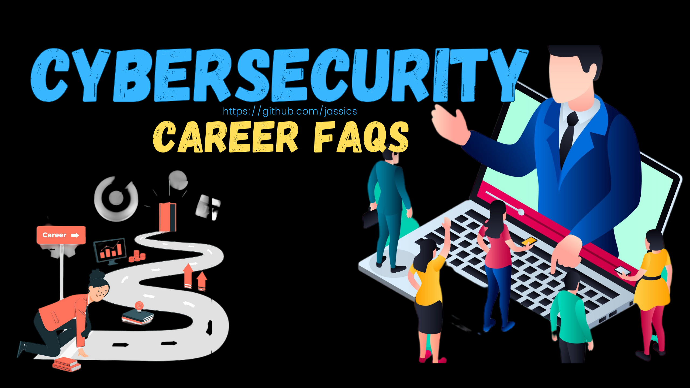

# Cybersecurity Career Advice FAQs
**FAQs for cybersecurity career advice from security experts.**

These FAQs should provide a comprehensive overview for those considering a cybersecurity career, addressing entry-level concerns and long-term career development.
We would also cover FAQs for security professionals seeking advice on job switches, upskilling, domain switches, etc.

> [!NOTE]
> This repo is written **for and about cybersecurity careers specifically**: people already in the field, or trying to get into it (from IT, dev, or a non-tech background). Every answer, including the AI-era questions below, is framed around how it plays out for security roles (AppSec, pentest, SOC/IR, GRC, security architecture, etc.), not tech careers in general.

## FAQs for Aspiring Cybersecurity Professionals
### 1. What educational background is needed for a career in cybersecurity?

Answer: While a degree in computer science, information technology, or a related field is beneficial, it is optional. Many successful cybersecurity professionals come from diverse educational backgrounds. Certifications like CompTIA Security+, CISSP, CEH, and others are highly valued and can sometimes substitute for a formal degree.

### 2. Which certifications are most valuable in the cybersecurity field?
Answer: Some of the most recognized and valuable certifications include:
1. Entry-level: CompTIA Security+, Cisco's CCNA Security, Certified Ethical Hacker (CEH)
2. Intermediate: GPEN, GIAC Security Essentials (GSEC), GWEB, OSCP, eJPT
3. Advanced: Certified Information Systems Security Professional (CISSP), CSSLP, Certified Information Security Manager (CISM), Certified Information Systems Auditor (CISA)

### 3. What skills are crucial for a successful career in cybersecurity?
Answer: Key skills include:
1. Technical skills: Understanding networks, operating systems, and programming languages (e.g., Python, Java).
2. Analytical skills: Ability to analyze complex systems and identify potential vulnerabilities.
3. Problem-solving skills: Creativity in developing solutions to security challenges.
4. Communication skills: Ability to explain technical issues to non-technical stakeholders.

### 4. What entry-level positions are available in cybersecurity?
Answer: Common entry-level positions include:
1. Security Analyst
2. Security Operations Center (SOC) Analyst
3. IT Auditor
4. Junior Penetration Tester
5. Incident Responder

### 5. How important is practical experience, and how can I gain it?
Answer: Practical experience is crucial in cybersecurity. You can gain experience through:
1. Internships 
2. Volunteering for non-profits or small businesses
3. Participating in capture-the-flag (CTF) competitions
4. Setting up your lab environment at home to practice

### 6. What are the current trends and emerging areas in cybersecurity?
Answer: Some current trends include:
1. Cloud Security
2. Artificial Intelligence and Machine Learning in Security
3. Internet of Things (IoT) Security
4. Zero Trust Architecture
5. Threat Intelligence and Analytics

### 7. How can I stay updated with the latest cybersecurity developments?
Answer: Staying updated in this domain is essential. You can:
1. Subscribe to cybersecurity blogs and podcasts (e.g., Krebs on Security, Darknet Diaries)
2. Follow industry leaders on social media
3. Attend conferences and webinars (e.g., DEF CON, Black Hat)
4. Participate in online forums and communities (e.g., Reddit, Stack Exchange)

### 8. What is the job outlook for cybersecurity professionals?
Answer: The job outlook for cybersecurity professionals is very positive. As cyber threats become more sophisticated, the demand for skilled cybersecurity experts continues to grow. The Bureau of Labor Statistics projects a much faster-than-average growth rate for information security analysts.

### 9. What do cybersecurity professionals face some common challenges?
Answer: Some common challenges include:
1. Keeping up with the rapidly evolving threat landscape
2. Managing stress and burnout due to high-pressure environments
3. Balancing security measures with user convenience
4. Continuous learning and upskilling to stay relevant

### 10. Can I move into cybersecurity from another IT role?
Answer: Yes, many professionals transition into cybersecurity from other IT roles. Skills and experience in network administration, software development, or systems engineering are highly transferable to cybersecurity roles.

### 11. Is programming knowledge necessary for success in the cybersecurity domain?
Well, it depends! 
Programming knowledge is essential in cybersecurity. It helps understand how software works, identify vulnerabilities, write automation scripts, conduct code reviews, and analyse malware. 

While not mandatory for every role, it's crucial for advanced areas like application security, reverse engineering, and secure software development. I'm also partially into the pentest job.

My suggestion is to learn the very basics of programming, like Python, and understand how to read and execute code.

### 12. It is necessary to be good at communication and soft skills; if so, why?
Aboslutely yes. Communication and soft skills are essential in cybersecurity. 
Security professionals must explain technical risks to non-technical stakeholders, collaborate with teams, and influence decision-making. 
Soft skills also help effectively manage security policies, incident response, and training.

> [!TIP]
> Moreover, when you grow up the ladder, you will see why people with good soft skills and writing skills are preferred in senior roles. That means you should be very good at your core skills!

### 13. What should I do to move from the Pentest role to the Security Architecture role?
To transition from a Pentesting role to a Security Architecture role:

- Develop a deep understanding of security design principles (e.g., defense-in-depth, secure software lifecycle).
- Gain experience in threat modeling and secure software architecture.
- Broaden your knowledge of compliance, risk management, and security frameworks (e.g., NIST, ISO).
- Learn to design scalable security solutions and align them with business goals.
- Improve communication skills for engaging with various stakeholders and leadership.

### 14. I have 90 days notice period. Recruiters don't entertain after hearing this. What do you think I should do to get an interview call?
Answer: A long notice period filters you out before a human even sees your profile, so work around it rather than against it:
1. Say it upfront in your resume/LinkedIn headline or summary ("90-day notice, negotiable to X with buyout") instead of letting it surface as a surprise at screening.
2. Check if your current employer allows notice buyout: many do for a cost; knowing your buyout cost and number lets you offer a shorter, negotiated date to recruiters.
3. Target roles/companies that explicitly list "notice period flexible" or are backfilling a role months out (large enterprises, government-adjacent, regulated industries) rather than urgent startup backfills.
4. Use your network and direct referrals instead of cold applications: a referral gets a notice-period conversation, a cold resume usually doesn't.
5. Start interview loops early and be transparent early; most interview processes (especially for senior security roles) take 4-8 weeks anyway, so your notice period may barely add delay by the time an offer lands.

## FAQs on AI's Impact on Cybersecurity Careers

> [!NOTE]
> These answers are scoped to cybersecurity roles: how AI/GenAI tooling changes work for a SOC analyst, pentester, AppSec engineer, security architect, or GRC professional. They are not generic "future of work" takes.

### 1. Is my cybersecurity job safe in the AI era?
Answer: Safe, but not unchanged. AI is automating the repetitive, high-volume parts of security work (log triage, alert correlation, first-pass code/config review, report drafting, phishing/IOC lookup), the same way SOAR and SIEM automation did before it. Roles built almost entirely around that repetitive layer (tier-1 SOC triage, manual log review) are shrinking fastest. Roles that require judgment under ambiguity (incident response decision-making, threat modeling, exploit chaining, risk prioritization, stakeholder communication) are growing in relative importance, because AI increases the volume of signal a smaller team must interpret correctly. Net effect: fewer people needed to do the same volume of routine work, more value placed on the people who can validate, direct, and be accountable for AI output.

### 2. How are security professionals actually using AI day to day?
Answer: Common, practical uses already in play:
1. **SOC/IR**: triaging and summarizing alerts, correlating logs across tools, drafting incident timelines and postmortems.
2. **AppSec/secure code review**: first-pass vulnerability scanning and explanation, generating secure-code fixes, reviewing AI-generated ("vibe coded") code for injected security gaps.
3. **Pentest/red team**: speeding up recon, payload/script drafting, report writing, not replacing exploitation judgment or scoping decisions.
4. **GRC/compliance**: drafting policy language, mapping controls across frameworks (NIST, ISO, CIS), summarizing audit evidence.
5. **Threat modeling/architecture**: using AI as a sparring partner to enumerate threats (e.g., STRIDE) faster, then validating manually.

The common thread: AI drafts, a human with domain judgment verifies and owns the decision. Professionals who can direct AI well (good prompting, knowing what to check, catching hallucinated CVEs or wrong framework mappings) are visibly faster than those who either avoid it entirely or trust it blindly.

### 3. With tools like Claude/Copilot writing code, is coding or system design still important for a security career?
Answer: More important, not less, just differently. If you can't read code, you can't tell whether the code an AI assistant wrote (or the code you're reviewing for a client) has a security flaw, an injected backdoor, or just confidently-wrong logic. AI shifts the valuable skill from "typing syntax" to "reading, reasoning about, and validating," which is exactly what secure code review, architecture review, and threat modeling already demanded. System design knowledge matters more for security roles specifically: trust boundaries, data flow, failure modes, and blast radius don't get the question right. If you're in or targeting AppSec, security architecture, or product security, you should be going deeper into system design and secure coding fundamentals, not skipping them because "AI can write it."

### 4. Will AI replace penetration testers / SOC analysts / GRC analysts?
Answer: Unlikely to fully replace any of these in the near-to-mid term, but the entry-level version of each role is getting squeezed:
- **Pentest**: AI accelerates recon and report writing, but exploitation, scoping, and judging real business impact of a finding still need a human; fully autonomous pentesting is still immature and legally/contractually risky to rely on unsupervised.
- **SOC**: tier-1 alert triage is the most automatable layer; tier-2/3 (investigation, hunting, response decisions) is harder to automate and becoming the entry bar instead of tier-1.
- **GRC**: AI speeds up control mapping and evidence summarization, but audit judgment, regulatory interpretation, and accountability for sign-off remain human.
Practical implication: don't aim to be "the person who does the routine task AI now does"; aim to be "the person who reviews, directs, and is accountable for what AI produces."

### 5. Should I specialize in AI/LLM security, or is it too early/niche?
Answer: It's a genuinely growing and still-understaffed specialization, not niche for long. Organizations adopting GenAI/agentic AI internally need people who understand prompt injection, insecure tool/agent permissions, RAG data leakage, model supply-chain risk, and governance (e.g., OWASP LLM/Agentic Top 10, NIST AI RMF, ISO 42001). If you're early-to-mid career, layering AI/LLM security on top of solid AppSec or security-architecture fundamentals (not instead of them) is a strong differentiator right now, similar to how cloud security was a differentiator a decade ago.

### 6. What new skills should cybersecurity professionals build because of AI?
Answer: Beyond core security fundamentals, prioritize:
1. **AI-assisted workflow literacy**: effective prompting, knowing AI tool limitations, verifying AI output rather than trusting it.
2. **AI/LLM-specific security knowledge**: prompt injection, agentic tool-permission risks, model/data supply chain, LLM-specific threat frameworks.
3. **Validation and judgment skills**: the ability to catch a wrong/hallucinated finding, CVE, or framework mapping produced by an AI tool. This is now a core job skill, not a nice-to-have.
4. **Communication**: as AI produces more first drafts, the human differentiator shifts further toward explaining risk and influencing decisions.

### 7. How do I talk about AI usage in interviews without sounding like I'm just "prompting," not actually skilled?
Answer: Frame it around judgment, not usage. Instead of "I use ChatGPT/Claude for X," say what you verified, caught, or decided that the tool couldn't: "I used an AI assistant to draft the initial vulnerability report, then validated each finding against the actual exploit and corrected two false positives it introduced." Interviewers in security roles are increasingly testing exactly this: can you tell when AI output is wrong. Demonstrating that is more valuable than demonstrating you can type a good prompt.

## FAQs on Certifications, Education & Career Path

### 1. Are certifications like CISSP, OSCP, eJPT, CISA, and Security+ actually important, or is experience enough?
Answer: Depends on what stage you're at and what the cert is actually for; they are not all equal, and none of them substitute for being able to do the job:
1. **Entry/career-switch (0-2 yrs)**: Security+, eJPT, CEH help you pass HR/ATS keyword filters and show baseline knowledge when you have no track record yet. Their value is almost entirely in getting the interview, not in doing the job.
2. **Hands-on/offensive roles (pentest, red team)**: OSCP is still the strongest signal because it's exam-proven hands-on exploitation, not multiple-choice; recruiters and hiring managers in this track weight it heavily. GPEN/GWEB/CRTO are respected alternatives.
3. **GRC/audit/compliance roles**: CISA, CISM, and ISO 27001 Lead Auditor matter a lot more here because the role itself is compliance-framework-driven; the cert maps directly to daily work.
4. **Senior/management track (10+ yrs)**: CISSP and CISM function less as proof of skill and more as an HR/procurement checkbox; many enterprise and government RFPs/job specs literally require "CISSP or equivalent" to even shortlist a candidate, regardless of actual depth. At this stage it's a door-opener, not a learning exercise.
5. **CSA (Cloud Security Alliance)** certs like CCSK are useful specifically if you're moving into cloud security: niche but relevant, not a general-purpose cert.

Rule of thumb: certs get you past filters and validate a baseline; real projects, CTFs, bug bounty, and job experience are what get you past the interview. Don't stack 4-5 certs hoping it compounds; pick 1-2 that match the track you want (offensive vs GRC vs management) and pair them with demonstrable hands-on work.

### 2. Is an MS in Cybersecurity worth it, or should I just get a security certification with work experience?
Answer: For most people already working in IT/tech, a certification + real experience beats a Master's on ROI, speed, and relevance:
- A cert (e.g., OSCP, CISA) takes months and costs a fraction of an MS, and directly signals a specific, current skill employers are hiring for right now.
- An MS (1-2 years, significant cost, especially abroad) makes sense mainly if: you're switching into tech/security from a completely unrelated field and need the structured foundation + campus placement pipeline, you want to move abroad and the degree helps with visa/work-authorization routes, or you're aiming for research/academia/highly specialized roles (e.g., cryptography, applied ML security) where a formal thesis and research credibility matter.
- An MS without hands-on labs, CTFs, or internship experience alongside it is a weak signal on its own; hiring managers in security consistently prioritize demonstrated hands-on skill over a degree title.
- If budget/time is a constraint, the higher-ROI path for most is: 1-2 focused certs + home-lab/CTF practice + real job experience, not a formal degree.

### 3. IC (Individual Contributor) role vs Managerial role: which is better, and why, in the Indian cybersecurity market?
Answer: There's no universally "better" path, it depends on what you're optimizing for, but here's how it plays out specifically in India:
1. **Pay ceiling**: In India, the IC track (especially deep technical: security architect, principal AppSec engineer, red team lead) now has a genuinely high pay ceiling at MNCs/product companies/GCCs; senior IC roles can match or exceed first-line manager pay, which wasn't true a decade ago. But beyond a point (Director+/VP), the highest compensation and visibility in Indian corporate structures still skews toward management.
2. **Job security and tenure**: Deep technical IC skill (e.g., being the go-to person for threat modeling or incident response) tends to be more portable across companies and more resistant to layoffs than a mid-level manager title, which is often company/org-structure specific and harder to directly transplant elsewhere.
3. **Promotion velocity**: In many Indian organizations, the fastest path to higher designations/pay bands has historically been people management, because org hierarchies are built around headcount and reporting lines. This is slowly changing as companies adopt formal IC tracks (Staff/Principal/Distinguished Engineer ladders), but it's still inconsistent outside large product companies and GCCs.
4. **Nature of work**: Management means your day fills with 1:1s, stakeholder meetings, budget/hiring, and less hands-on security work: satisfying if you like influence and org-building, draining if you got into security to solve technical problems.
5. **Market demand**: India's GCC and product-company boom (global capability centers for MNCs) has sharply increased demand for senior IC security architects and specialists who can operate independently without needing a large reporting team; this track has gotten stronger, not weaker, in the last few years.

Practical advice: don't default into management just because it's the "next step," that's still the common trap in Indian corporate culture. If you enjoy hands-on technical depth and your company has (or peer companies have) a real Staff/Principal IC ladder, the IC path is increasingly viable to stay in for your whole career. Choose management only if you genuinely want to spend most of your time on people and business problems, not because it looks like the only way up.

## FAQs for Freshers Entering Cybersecurity

### 1. How do I get my first cybersecurity job with zero experience?
Answer: Treat the first job as a bridge, not your dream role:
1. Build visible proof of skill before you apply: a home lab (TryHackMe/HackTheBox progress, a personal SOC/SIEM setup), 2-3 writeups of CTF challenges or vulnerable-app walkthroughs on GitHub/a blog.
2. Target entry roles that hire for aptitude over experience: SOC Tier-1 analyst, IT helpdesk-to-security internal transfers, junior GRC/audit support, QA-to-security transitions.
3. Use referrals aggressively: cybersecurity hiring in India still leans heavily on referrals and community (local DEF CON/null meetups, LinkedIn security groups) over cold applications.
4. Get one entry cert (Security+ or eJPT) mainly to pass resume filters, not as the main credential.
5. Apply to MSSPs, IT services companies, and GCC security teams: they hire freshers at far higher volume than product companies, and are a legitimate stepping stone, not a dead end.

### 2. Is a bug bounty / CTF portfolio enough to replace work experience on a resume?
Answer: It can get you the interview but rarely fully replaces experience for the hire; treat it as a strong supplement, not a substitute:
- A solid bug bounty track record (valid reports on HackerOne/Bugcrowd, CVEs credited) or a high CTF ranking proves hands-on offensive skill better than almost any cert, and is taken seriously for pentest/red-team hiring.
- It's weaker signal for roles that need organizational context: incident response under real business pressure, working with compliance/legal, cross-team collaboration, things CTFs don't simulate.
- Best use: pair it with even a few months of any IT/security job (internship, support role) so you have both proof of skill and proof you can function in a work environment.

### 3. Which specialization should a fresher pick first: SOC, AppSec, pentest, or GRC?
Answer: Pick based on your strongest existing instinct, not what sounds most prestigious:
- **SOC/Blue team**: best if you like patterns, monitoring, and systematic investigation; lowest barrier to entry, highest volume of entry-level openings, good for learning the full threat landscape before specializing further.
- **AppSec**: best if you already have or want development/coding background; works well as a dev-to-security pivot.
- **Pentest/red team**: best if you enjoy breaking things and have strong networking/OS fundamentals; typically needs more self-driven lab practice before you're hireable, harder first-job market than SOC.
- **GRC**: best if you're naturally strong at writing, process, and stakeholder communication over deep technical hacking; especially viable for non-CS backgrounds (finance, law, business) moving into security.
SOC is the most common and lowest-friction entry point precisely because it exposes you to alerts, logs, and incidents across every other domain; many people use it as a one-to-two-year springboard before moving into AppSec, pentest, or architecture.

### 4. Are cybersecurity bootcamps worth it compared to self-study?
Answer: Worth it mainly for structure and accountability, not for unique content you can't find yourself:
- Bootcamps help people who struggle to stay disciplined with self-study, and some offer real placement assistance; check placement track record before paying, not just the curriculum.
- Nearly all bootcamp content (networking, OS basics, common tools) is available free or cheap via TryHackMe, HackTheBox, Cybrary, and official vendor docs; self-study costs far less if you can stay consistent.
- Red flag: bootcamps that promise guaranteed six-figure/lakh salaries or "job in 90 days"; vet reviews and actual outcomes, not the sales pitch.
- Good litmus test: if you can already commit to a weekly study plan on your own, self-study + one cert + a lab is cheaper and just as effective; if you need external structure to not quit, a reputable bootcamp can be worth the cost.

## FAQs for Mid-Career Specialization

### 1. When is the right time to specialize (cloud security, AI/LLM security, OT/ICS, etc.) vs staying a generalist?
Answer: Generalize for roughly your first 2-3 years, then specialize once you notice a pull toward a specific domain:
- Early career, breadth compounds; understanding networking, OS internals, basic AppSec, and incident response together makes you more effective at anything you later specialize in.
- Specialize once you can answer "what do I want to be the go-to person for"; the signal is usually that you're already gravitating toward certain tickets/projects, or a high-growth niche (cloud, AI/LLM security) is visibly understaffed at your company.
- Don't specialize purely because a niche is trending; specializing in something you find boring just because demand is high leads to early burnout. Demand matters, but so does genuine interest since you'll be doing deep, hard problems in it for years.

### 2. How do I move from a generalist SOC/analyst role into a specialized track like red team or security architecture?
Answer: Make the move visible before you ask for the title change:
1. Volunteer for tasks adjacent to the target track: help with a pentest finding remediation, assist on a threat model, shadow an architecture review, while still in your current role.
2. Build the missing hard skills outside work hours (OSCP/CRTO for red team; ASVS/STRIDE practice and system design study for architecture).
3. Make an internal case to your manager for a lateral move or stretch assignment before jumping companies; internal moves are faster and lower-risk than trying to convince an external employer you can do a role you've never held.
4. If internal mobility isn't available, target companies with a known track for this transition (consulting firms often have explicit SOC to pentest or analyst to architect ladders) and be upfront in interviews about the transition you're making and the proof you've built for it.

### 3. Is it better to go deep in one domain (e.g., AppSec) or broad across domains for long-term career growth?
Answer: Depth usually wins for individual contributor career ceiling; breadth usually wins for leadership/architecture career ceiling. The two tracks need different shapes of skill:
- Deep specialists (e.g., a recognized AppSec or cloud security expert) command premium pay and are harder to replace, but can hit a ceiling if the company has limited need for that specific depth.
- Security architects, CISOs, and consultants need breadth: enough fluency across AppSec, network, cloud, GRC, and IR to make cross-domain tradeoffs and talk credibly to every team.
- Practical path many successful people follow: go deep in one domain for 3-5 years to build real expertise and credibility, then deliberately broaden from that base rather than starting broad and shallow. Depth-first-then-broad tends to produce stronger architects and leaders than broad-from-day-one.

## FAQs on Compensation & the Indian Market

### 1. How do I negotiate salary in cybersecurity roles in India without competing offers?
Answer: You can still negotiate meaningfully without a competing offer, using leverage other than "another company wants me":
1. Anchor to market data (Glassdoor, AmbitionBox, Levels.fyi equivalents, recruiter conversations) and state a specific number backed by it, not a vague "industry standard."
2. Highlight scarce, hard-to-replace skills (cloud security, AI/LLM security, specific compliance certifications the company needs for an audit); scarcity is leverage even without a second offer.
3. Negotiate the total package, not just base: variable pay, ESOPs/RSUs (common in product companies/GCCs), learning budget, remote flexibility, and certification sponsorship all have real value.
4. Time it around performance reviews or right after a notable contribution (closing an audit, finding a critical vuln) rather than mid-cycle, when budgets are less flexible.
5. Be willing to actually walk; negotiating without any willingness to decline the offer caps how much movement you'll realistically get.

### 2. Why do cybersecurity salaries in India lag behind the US/EU for similar roles, and how do I close that gap?
Answer: The gap is mostly structural (cost-of-living arbitrage, GCC/service-model pricing, and talent supply), not a reflection of skill difference. A few ways professionals close it:
1. **Target GCCs and MNC product teams** (Global Capability Centers) over domestic service companies: GCCs often pay India salaries 30-60% above local service-industry pay for the same security work, because they benchmark against regional/global pay bands, not pure local market rate.
2. **Remote work for US/EU-based companies or clients**: fully remote security roles (especially AppSec, pentest, and cloud security consulting) for overseas employers can pay significantly more than an equivalent India-based role, though factor in tax/compliance complexity (e.g., being paid as a contractor).
3. **Freelance/contract work and bug bounty** for international clients/programs pays in USD and sidesteps domestic pay bands entirely for the right skill level.
4. **Niche specialization** (AI/LLM security, cloud security architecture) commands a premium everywhere, and the premium is proportionally larger in the India market where such specialists are scarcer.
Realistic expectation: the gap won't fully close for most people staying fully domestic and generalist, but GCCs, remote-for-overseas roles, and scarce specializations meaningfully narrow it.

### 3. Service company vs product company vs GCC: which gives better long-term growth in security?
Answer: Each has a genuinely different value proposition. The "best" one depends on what stage of growth you need:
- **Service/IT consulting companies** (TCS, Infosys, Wipro-type, and boutique security consultancies): best for breadth early on; you'll touch many clients, industries, and tool stacks fast, which builds versatility, but pay growth and depth in any one domain is typically slower.
- **Product companies**: best for depth and ownership; you often own a specific security domain (e.g., platform security for one product) end-to-end, pay scales well with skill, but exposure is narrower to that product's stack.
- **GCCs (Global Capability Centers)**: increasingly the sweet spot in India: pay closer to global bands, exposure to mature security programs and global standards, often a real Staff/Principal IC ladder, but you're still serving a parent org's priorities, which can limit strategic influence compared to an India-headquartered product company.
General pattern many careers follow: service company (breadth, 1-3 yrs) to product company or GCC (depth + better pay, 3+ yrs) to architecture/leadership from either. Don't treat it as a one-time irreversible choice; moving between these categories as your priorities shift is common and accepted in the Indian market.

## FAQs on Job Security & Resilience

### 1. How layoff-proof is a cybersecurity career compared to other tech roles?
Answer: More resilient than most tech roles on average, but not immune. Security is usually one of the last functions cut and one of the first rebuilt, for a structural reason: regulatory, compliance, and insurance requirements (SOC 2, ISO 27001, cyber-insurance preconditions) make a baseline security function close to mandatory, not optional, for most mid-size-and-up companies. That said:
- Generalist, lower-skill security roles (basic Tier-1 SOC monitoring) are the most exposed to both AI automation and cost-cutting.
- Roles tied directly to compliance deadlines, audits, or active incident response are the most protected, because the cost of not having them (failed audit, breach, regulatory fine) is immediate and visible to leadership.
- Overall industry demand has stayed strong through multiple broader tech layoff waves, but individual company layoffs still happen; don't treat "cybersecurity" as a blanket guarantee at any specific employer.

### 2. What happens to a cybersecurity career after a layoff, how hard is the comeback?
Answer: The comeback is generally faster than in many other tech functions, because of sustained industry demand, but the job search itself can still take months:
1. Expect 2-4 months of active search in a normal market for a mid-level security role in India; longer if targeting a narrow niche or a big brand name specifically.
2. Use the gap productively and visibly: a cert, a CTF ranking improvement, a published writeup, so the gap reads as "upskilling" rather than an unexplained pause to recruiters.
3. Lean on community and referrals harder than before layoff; security-specific communities (null, DSCI events, OWASP chapter meetups) are disproportionately useful for landing the next role through warm introductions rather than cold applications.
4. A layoff from a well-known company is rarely a stigma in security hiring right now, given how visible recent mass tech layoffs have been; don't over-apologize for it in interviews, state it factually and move on to your value.

### 3. Is cybersecurity a safe pivot for someone from a non-tech or non-CS background?
Answer: Yes, for several tracks specifically, but not equally safe for every track:
- **GRC, compliance, risk, security awareness/training**: genuinely strong fit for non-CS backgrounds (law, finance, business, psychology); these roles value writing, process thinking, and stakeholder communication as much as or more than deep technical skill.
- **SOC/analyst roles**: possible with focused upskilling (networking fundamentals, a SOC-focused cert, a home lab) over 6-12 months; harder than GRC but very achievable.
- **Deep technical tracks (pentest, exploit development, security architecture)**: possible but requires the most ground to cover, realistically 1-2+ years of consistent hands-on study before you're competitive, since these need strong CS/networking fundamentals most non-tech backgrounds lack initially.
Pick the entry track based on your existing strengths (a lawyer has a GRC head start; a sysadmin has a SOC head start) rather than picking the most "exciting" track and fighting your own background.

## FAQs on Freelance & Alternate Career Paths

### 1. Can I build a cybersecurity career through freelancing/bug bounty full-time in India?
Answer: Possible, but high-variance and generally better as a secondary income stream until proven, not a default first move:
- A small percentage of bug bounty hunters earn full-time-equivalent or better income consistently, but most who go full-time early face income instability; bounty payouts are irregular and competitive, and earnings for even skilled hunters often fluctuate month to month.
- Freelance security consulting (VAPT engagements, compliance audits) for SMBs/startups is more stable income than bounty-only, but requires an existing network/reputation to get consistent clients, which usually comes from a prior job.
- A viable path many follow: build bug bounty/freelance income as a side activity while employed, and only transition full-time once it demonstrably matches or exceeds your salary for 6-12 consecutive months, not based on a single good payout.

### 2. Is it realistic to do security consulting or training as a side income while employed?
Answer: Yes, and it's a well-trodden path in the Indian security community, but check your employment contract first:
1. Review your employment agreement for moonlighting/conflict-of-interest clauses before taking paid side work; many Indian employers explicitly restrict or require disclosure of outside work, especially anything competing with your employer's business.
2. Training/content creation (workshops, courses, YouTube/newsletter) has the lowest conflict risk and compounds your personal brand, which helps your main career too.
3. Freelance VAPT/consulting for external clients carries higher conflict-of-interest risk if your employer is also in security services; stick to clearly non-competing clients/industries or get explicit sign-off.
4. Side income is a reasonable hedge against layoffs and a way to test full-time freelancing viability (see above) without burning the stability of your main job first.
